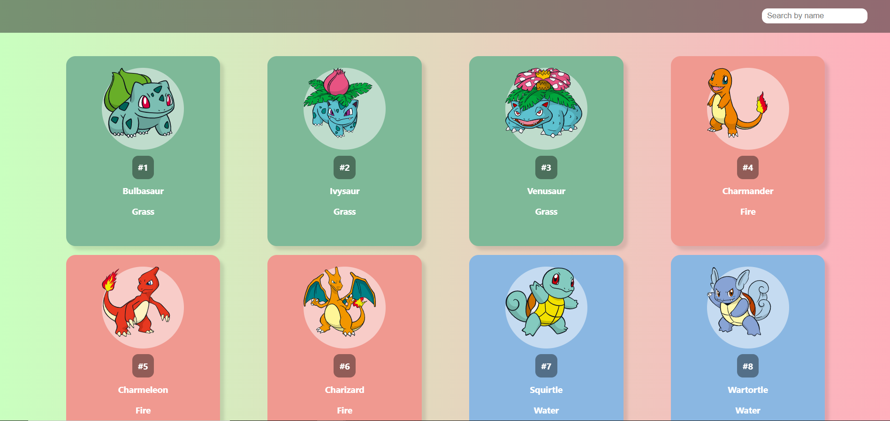
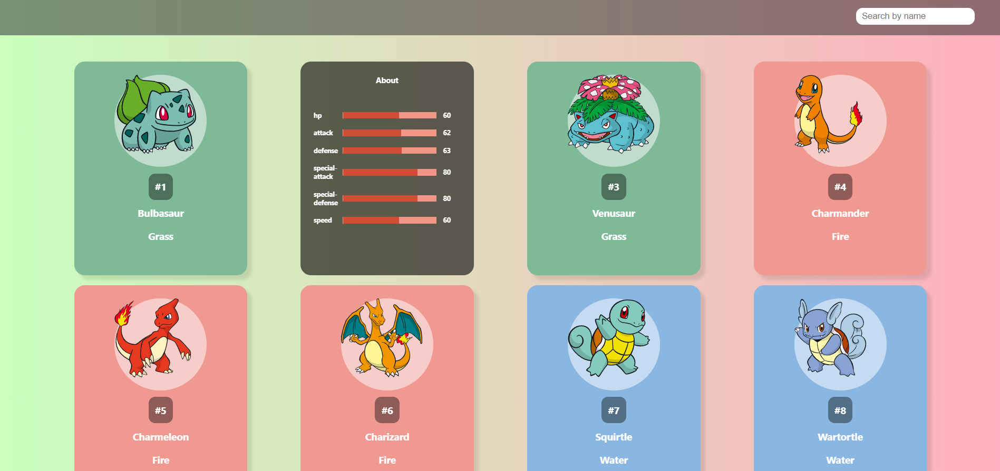
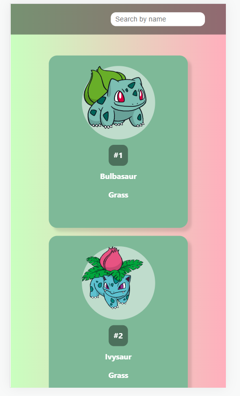

# Revirtspace Assignment 🚀

[Live link](https://main--playful-monstera-7f9358.netlify.app/)

**The mobile view starts with the search section**

**The Courses section Are kept beside as apps look generally**

## Welcome! 👋

Thanks for checking out my repository.

**This is to explain what all I have done in the assignment so far**

## All about this project

1. This is a React Application which is using Pokemon API to fetch data and show it.
2. Search Option is provided which helps user to search a charecter from the available ones.
3. Load more button can be used to load more items and expand the field of search.
4. Search is optimised so that it is only performed when user waits for a second while typing.
5. Application is fully responsive and fits to the device size and is based on CSS grids

